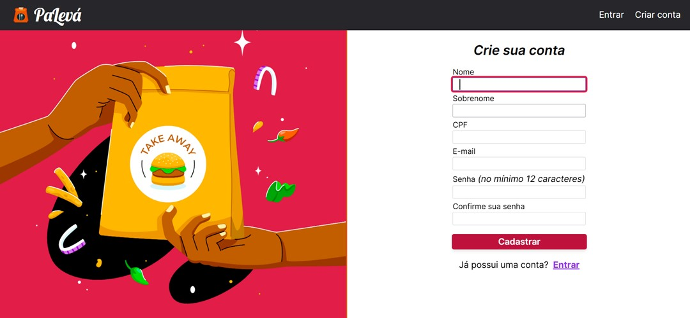

# Projeto PaLevá (Take Away)

Projeto em desenvolvimento para o sistema **PaLevá (Take Away)**, um aplicativo web para gerenciamento de cardápio de um restaurante, permitindo que os proprietários de restaurantes cadastrem pratos e gerenciem o cardápio de forma prática e organizada.


## Tecnologias Utilizadas
- **Ruby**: 3.3.4
- **Rails**: 7.1.4.1
- **Tailwind CSS**: para estilização do frontend


## Funcionalidades
- Registro e gerenciamento de pratos com características como "vegetariano", "vegano", "sem glúten", entre outros.
- Cadastro de preços e histórico de preços para acompanhar alterações.
- Organização e filtragem de pratos por características e categorias.
- Interface estilizada com Tailwind CSS.


## Screenshots


* Para ver mais Screenshots das telas do sistema:
[Clique aqui](./screenshots)


## Configuração do Projeto

1. Clone o repositório:

    ```bash
    git clone https://github.com/seu_usuario/paleva_take_away.git
    ```

2. Instale as dependências:

    ```bash
    bundle install
    ```

3. Configure o banco de dados:

    ```bash
    rails db:migrate
    ```

4. Inicie o servidor:

    ```bash
    rails server
    ```


